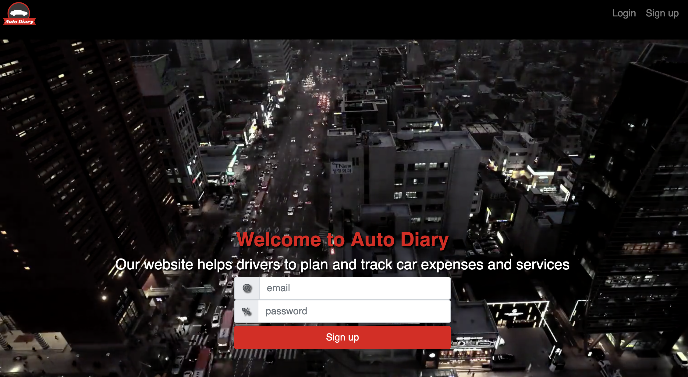

<b>Auto Diary</b> - сервис для мониторинга расходов на эксплуатацию автомобиля.

<b><h3>About:</h3>

</b>
</img>

<b><h3>Get started:</h3>

</b>
В папках front и backend:
<code>
npm install;
npm start
</code>

<b><h3>MVP:</h3>

</b>

<ul>
  <li>Добавление автомобиля с аватаром, 39 марок авто</li>
  <li>Регистрация и логин</li>
  <li>Добавление истории работ к конкретному авто</li>
  <li>Просмотр графика ТО</li>
</ul>

<b><h3>Authors:</h3>

</b>

<ul>
  <li><a href="https://github.com/xanderoku">Александр Окунев</li>
  <li><a href="https://github.com/iti92">Юлиан Топал</li>
  <li><a href="https://github.com/panferovDev">Антон Панферов</li>
  <li><a href="https://github.com/melAntagonista">Элен Смирнова</li>
</ul>

<b><h3>Technologies:</h3>

</b>

Node.js, React, Express.js, MongoDB, Mongoose, JWT, Babel, Reactstrap, React-spring
